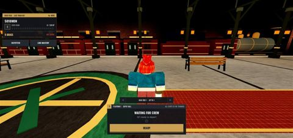
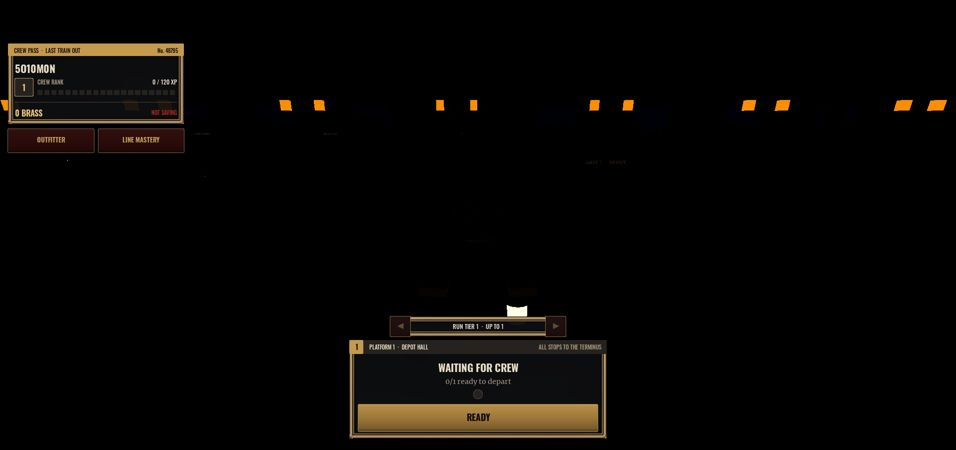
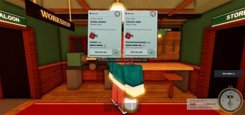
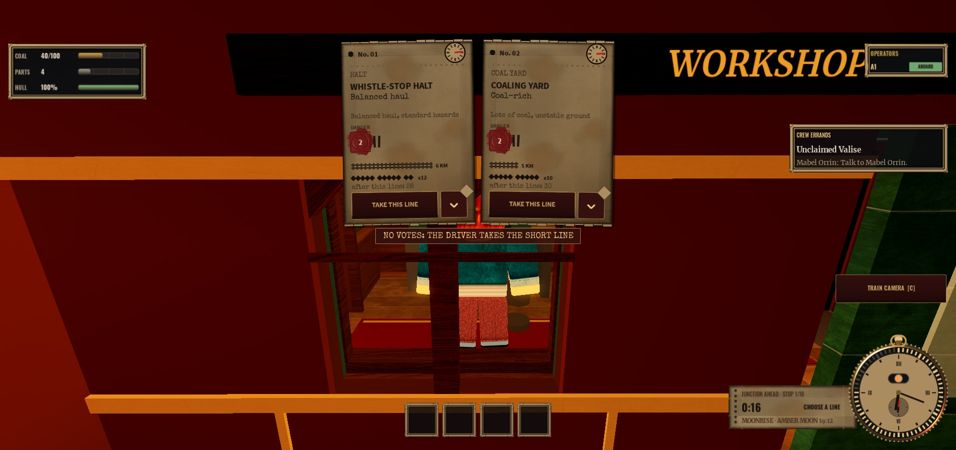
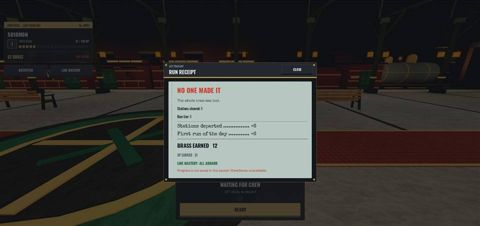
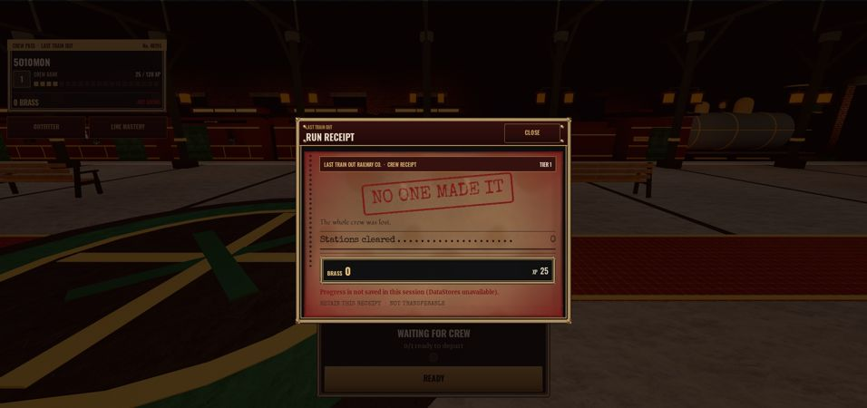
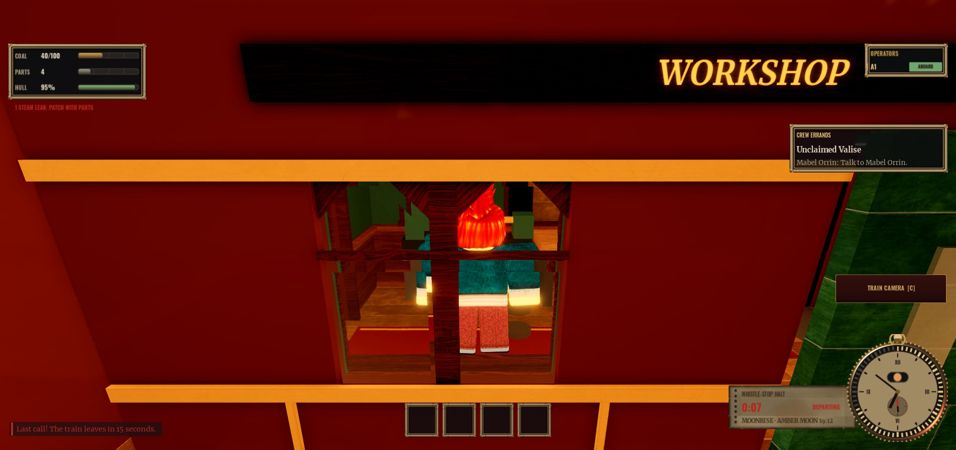
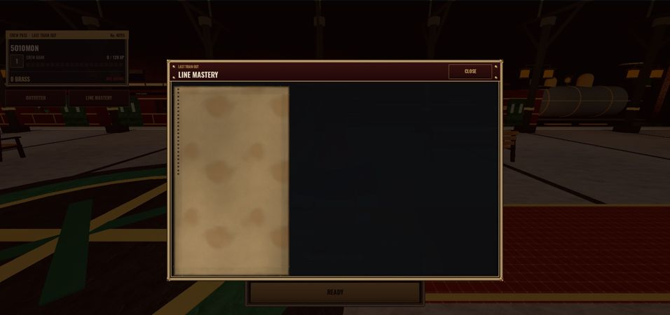

# UI overhaul: Blood Moon Mail (2026-10-08)

Before shots are the Night Mail pass (`docs/compare/after_*`); after shots are Studio play captures, at half scale.

| Surface | Before | After |
|---|---|---|
| Lobby |  |  |
| Route vote |  |  |
| Run receipt |  |  |
| Run HUD | |  |
| Modal shell | |  |

## What changed
- **Design system** (`UI/Theme`): darker palette (soot, oxblood leather, bottle-green lacquer, mahogany, ember, amber, moon red, deep blood), aged amber card instead of grey-green, bone text instead of white, Merriweather body, Fondamento hand. `Theme.Image` lists the baked textures; `Theme.Slice` the rim widths.
- **Assets** (`assets/ui`, sources in `tools/uiart`, credits in `docs/ASSET_CREDITS.md`): Blender renders of the brass frame, rivet, wax seal, watch bezel and enamel plate; NumPy textures for paper grain, iron grain, edge burn, glow, stamp grunge, vignette and punch holes; two 9-slice composites (iron panel with brass rim, aged card).
- **Shared components** (`UI/Ui`): panels are textured iron in a blackened-brass rim; tickets are aged, scorched card with grain and punched perforations; buttons have an enamel gradient, and Secondary is now oxblood with brass text; meters are glass tubes in an engraved channel.
- **Modal shell**: oxblood title board with rendered rivets, a thicker rim and a backdrop dark with a red tint.
- **Prompts**: iron plate, brass keycap, ember hold bar.
- **HUD**: Blender bezel on the pocket watch; its rim burns ember, then moon red, in the last seconds; brass-rimmed hotbar wells; the stop ticket idles at 80% opacity so it stays readable.
- **Route tickets**: aged stock, rendered wax seals with the number pressed in, oxblood vote button (brass when chosen), ember selection rim, leather flap. The sealed ticket's lantern now glows blood red. The vote banner is a telegraph strip on oxblood. The dossier sheet is aged card.
- **Run receipt**: rebuilt as a company slip: header band (company, tier), rubber-stamped outcome with ink knock-outs, a handwritten line, dotted-leader ledger, a double totals rule, an iron Brass/XP strip and a tear-off foot. It is sized to its content, red-lit for lost runs and warm for the Terminus.
- **Run card**: tinted and vignetted by outcome. **Line Mastery**: stats sit on an aged ledger card. **Workshop**: lacquered rows. **Struggle**: brass keycap.

## Not verified
- I could not drive the Studio window (computer-use access was declined), so I opened Outfitter, Workshop and Line Mastery only by forcing them visible, with no data in them. I could not test hover, pressed or gamepad-focus states, the Device Simulator (phone and tablet), the expanded or voted ticket states, the sealed ticket, or a victory receipt.
- I have not restyled the TicketBook, Unseal, Spectate, CarBoarding, ChalkSlate or Overlay toasts on their own; they only pick up the new palette.
- The uploaded image ids are new. If an image is still in moderation it shows blank until Roblox approves it.
